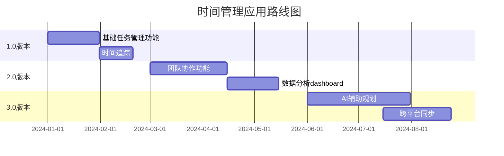
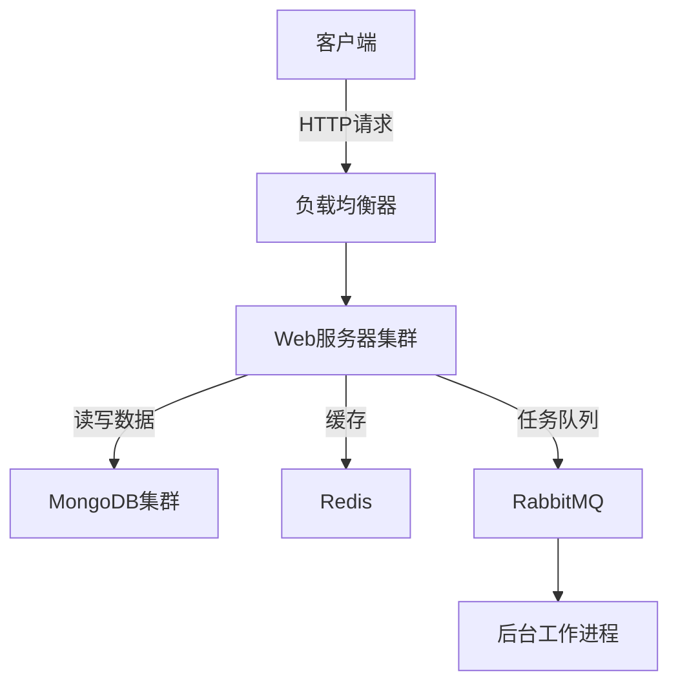

# 第三部分：开发与实现篇

在这一部分，我们将深入探讨产品设计和开发的核心环节。作为独立开发者，掌握这些技能对于打造成功的产品至关重要。我们将从产品定义开始，一直到实际的开发实践，为你提供全面的指导。

# 第5章：产品设计与开发

本章将带领你走过产品设计和开发的整个过程。我们将从用户需求分析开始，探讨如何设计出色的用户体验，选择合适的技术栈，并应用敏捷开发方法来提高效率。

## 5.1 产品定义与需求分析

产品定义和需求分析是整个开发过程的基石。在这个阶段，我们需要深入理解用户需求，明确产品定位，并制定清晰的开发计划。

### 5.1.1 用户痛点分析

用户痛点分析是产品成功的关键。作为独立开发者，我深知理解用户需求的重要性。以下是我进行用户痛点分析的方法：

1. 用户调研：通过问卷、访谈或观察等方式收集用户反馈。
2. 数据分析：利用现有产品的使用数据，找出用户遇到的问题。
3. 竞品分析：研究竞争对手的产品，了解市场上的痛点。
4. 社交媒体监听：关注用户在社交平台上的讨论和抱怨。

案例分析：
假设我正在开发一款时间管理应用。通过用户调研，我发现很多人抱怨难以平衡工作和个人生活。这个痛点成为了我产品设计的核心focus。

### 5.1.2 功能优先级排序

确定了用户痛点后，下一步是对功能进行优先级排序。这对于资源有限的独立开发者尤为重要。我通常采用以下步骤：

1. 列出所有潜在功能
2. 评估每个功能的价值和实现难度
3. 使用优先级矩阵进行排序
4. 确定MVP（最小可行产品）的核心功能

优先级矩阵示例：

```
高价值/低难度 | 高价值/高难度
-------------|-------------
低价值/低难度 | 低价值/高难度
```

我会优先实现高价值/低难度的功能，这些通常能快速为用户带来价值。

### 5.1.3 产品路线图制定

产品路线图是指导产品长期发展的战略工具。作为独立开发者，我发现制定清晰的路线图有助于保持focus和动力。以下是我的制定步骤：

1. 设定长期目标（6-12个月）
2. 将目标分解为可实现的里程碑
3. 为每个里程碑设定时间框架
4. 定期review和调整路线图

示例路线图：



通过这样的路线图，我可以清晰地看到产品的发展方向，并据此安排开发计划。

## 5.2 用户体验设计

用户体验（UX）设计是产品成功的关键因素。作为独立开发者，我深知即使是技术性很强的产品，如果用户体验不佳，也难以获得用户的青睐。

### 5.2.1 用户界面(UI)设计原则

在设计用户界面时，我遵循以下核心原则：

1. 简洁性：保持界面简洁明了，避免视觉混乱。
2. 一致性：在整个应用中保持设计风格、交互方式的一致。
3. 可见性：重要功能应该明显可见，避免用户需要猜测。
4. 反馈：对用户的每个操作提供及时、清晰的反馈。
5. 容错：设计应该能预防用户错误，并在错误发生时提供简单的恢复方式。

实践示例：
在我的时间管理应用中，我采用了极简的设计风格。主页面只显示最关键的信息：今日待办、时间统计和快速添加任务按钮。所有元素都采用一致的配色和字体，确保视觉和谐。

```html
<!-- 简化的主页面HTML结构 -->
<div class="main-container">
  <header>
    <h1>今日概览</h1>
    <button id="quick-add">+ 添加任务</button>
  </header>
  <section id="today-tasks">
    <!-- 今日待办列表 -->
  </section>
  <section id="time-stats">
    <!-- 时间统计图表 -->
  </section>
</div>
```

### 5.2.2 用户流程优化

优化用户流程是提升用户体验的关键。我通常遵循以下步骤：

1. 绘制用户流程图
2. 识别并消除不必要的步骤
3. 简化复杂操作
4. 添加快捷方式
5. 进行用户测试并迭代改进

以添加新任务为例，我将原本需要多个步骤的过程简化为一个快速添加功能：

```javascript
// 快速添加任务功能
function quickAddTask() {
  const taskInput = document.getElementById('quick-task-input');
  const taskText = taskInput.value.trim();
  
  if (taskText) {
    addTaskToList(taskText);
    taskInput.value = '';
    showNotification('任务已添加');
  }
}

// 事件监听
document.getElementById('quick-add').addEventListener('click', () => {
  // 显示快速添加输入框
  showQuickAddInput();
});
```

### 5.2.3 响应式设计考虑

在当今多设备环境下，响应式设计变得尤为重要。我的响应式设计策略包括：

1. 使用弹性布局（Flexbox或Grid）
2. 采用相对单位（如em、rem、%）
3. 使用媒体查询适配不同屏幕尺寸
4. 考虑触摸友好的交互设计
5. 优化图片和资源加载

示例CSS：

```css
/* 基础样式 */
.main-container {
  display: flex;
  flex-direction: column;
  padding: 1rem;
}

/* 媒体查询 */
@media (min-width: 768px) {
  .main-container {
    flex-direction: row;
    justify-content: space-between;
  }
  
  #today-tasks, #time-stats {
    width: 48%;
  }
}

/* 触摸友好的按钮样式 */
.touch-friendly-btn {
  min-width: 44px;
  min-height: 44px;
  padding: 0.5rem 1rem;
}
```

## 5.3 技术选型与架构设计

作为独立开发者，选择合适的技术栈和设计可扩展的架构至关重要。这不仅影响开发效率，还决定了产品的长期可维护性和性能。

### 5.3.1 前端技术栈选择

在选择前端技术栈时，我考虑以下因素：

1. 学习曲线和个人熟悉度
2. 社区活跃度和生态系统
3. 性能和用户体验
4. 长期维护和更新
5. 跨平台能力

基于这些考虑，对于我的时间管理应用，我选择了以下技术栈：

- 框架：React.js（易学习、组件化、强大的生态系统）
- 状态管理：Redux（可预测的状态管理，适合复杂应用）
- UI组件库：Material-UI（美观、响应式、易于定制）
- 构建工具：Webpack（强大的模块打包器）

示例代码（React组件）：

```jsx
import React from 'react';
import { useSelector, useDispatch } from 'react-redux';
import { Button, TextField } from '@material-ui/core';
import { addTask } from './actions';

const QuickAddTask = () => {
  const dispatch = useDispatch();
  const [taskText, setTaskText] = React.useState('');

  const handleAddTask = () => {
    if (taskText.trim()) {
      dispatch(addTask(taskText));
      setTaskText('');
    }
  };

  return (
    <div>
      <TextField
        value={taskText}
        onChange={(e) => setTaskText(e.target.value)}
        placeholder="输入新任务"
      />
      <Button onClick={handleAddTask} variant="contained" color="primary">
        添加
      </Button>
    </div>
  );
};

export default QuickAddTask;
```

### 5.3.2 后端架构设计

后端架构的选择同样重要。我的考虑因素包括：

1. 可扩展性
2. 性能
3. 安全性
4. 开发效率
5. 部署和维护成本

对于我的应用，我选择了以下架构：

- 语言/框架：Node.js with Express（JavaScript全栈，开发效率高）
- 数据库：MongoDB（灵活的文档型数据库，适合快速迭代）
- API设计：RESTful API（标准化、易于理解和使用）
- 身份认证：JWT（无状态、可扩展）
- 部署：Docker容器化（一致的开发和生产环境）

后端架构示意图：



### 5.3.3 数据库选型

数据库的选择直接影响应用的性能和可扩展性。对于时间管理应用，我选择了MongoDB，原因如下：

1. 灵活的文档模型，适合快速迭代
2. 良好的水平扩展能力
3. 强大的查询和聚合功能
4. 对JavaScript友好，与Node.js配合良好

示例数据模型（Mongoose Schema）：

```javascript
const mongoose = require('mongoose');

const TaskSchema = new mongoose.Schema({
  user: { type: mongoose.Schema.Types.ObjectId, ref: 'User', required: true },
  title: { type: String, required: true },
  description: String,
  dueDate: Date,
  status: { type: String, enum: ['pending', 'in_progress', 'completed'], default: 'pending' },
  tags: [String],
  createdAt: { type: Date, default: Date.now },
  updatedAt: { type: Date, default: Date.now }
});

TaskSchema.index({ user: 1, status: 1, dueDate: 1 }); // 优化查询性能

module.exports = mongoose.model('Task', TaskSchema);
```

## 5.4 敏捷开发实践

作为独立开发者，采用敏捷开发方法可以帮助我更高效地管理项目，快速响应变化。

### 5.4.1 Scrum方法论应用

虽然Scrum通常用于团队协作，但我发现它的核心理念对独立开发者同样有益。我的个人Scrum实践包括：

1. 制定产品待办列表（Product Backlog）
2. 规划短期冲刺（通常是1-2周）
3. 每日站会（自我检查和计划）
4. 冲刺评审和回顾

我使用Trello来管理我的Scrum流程：

```
Trello看板结构：
- 待办事项（Product Backlog）
- 本次冲刺（Sprint Backlog）
- 进行中
- 已完成
- 已发布
```

### 5.4.2 持续集成与部署(CI/CD)

即使是独立开发者，CI/CD也能大大提高效率和代码质量。我的CI/CD流程如下：

1. 代码提交触发自动化测试
2. 测试通过后自动构建
3. 构建成功后自动部署到测试环境
4. 手动确认后部署到生产环境

我使用GitHub Actions来实现这个流程。以下是一个简化的workflow文件：

```yaml
name: CI/CD

on:
  push:
    branches: [ main ]
  pull_request:
    branches: [ main ]

jobs:
  test:
    runs-on: ubuntu-latest
    steps:
    - uses: actions/checkout@v2
    - name: Use Node.js
      uses: actions/setup-node@v1
      with:
        node-version: '14.x'
    - run: npm ci
    - run: npm test

  deploy:
    needs: test
    runs-on: ubuntu-latest
    steps:
    - uses: actions/checkout@v2
    - name: Deploy to Heroku
      uses: akhileshns/heroku-deploy@v3.12.12
      with:
        heroku_api_key: ${{secrets.HEROKU_API_KEY}}
        heroku_app_name: "your-app-name"```yaml
        heroku_email: "your-email@example.com"
```

### 5.4.3 版本控制最佳实践

作为独立开发者，良好的版本控制习惯对于项目的可维护性至关重要。以下是我遵循的一些最佳实践：

1. 使用Git Flow工作流
    - `main`分支保持稳定，只合并经过充分测试的代码
    - 使用`develop`分支进行日常开发
    - 为新功能创建`feature`分支
    - 使用`release`分支准备发布
    - 使用`hotfix`分支快速修复生产问题

2. 编写清晰的提交信息
   我遵循Angular的提交信息格式：

   ```
   <type>(<scope>): <subject>

   <body>

   <footer>
   ```

   例如：
   ```
   feat(task-management): add drag-and-drop functionality

   - Implement drag-and-drop for tasks between different status columns
   - Add visual feedback during drag operations
   - Optimize performance for large task lists

   Closes #123
   ```

3. 定期创建标签和发布
   每次重要更新后，我都会创建一个新的Git标签：

   ```bash
   git tag -a v1.2.0 -m "Version 1.2.0 - Add task prioritization feature"
   git push origin v1.2.0
   ```

4. 使用.gitignore文件
   确保不将敏感信息或不必要的文件包含在版本控制中：

   ```
   # .gitignore
   node_modules/
   .env
   *.log
   .DS_Store
   ```

5. 定期进行代码审查
   虽然我是独立开发者，但我仍然会定期审查自己的代码。我使用GitHub的Pull Request功能，即使是对自己的代码也创建PR，这样可以：
    - 在合并前再次检查更改
    - 运行自动化测试和CI流程
    - 为将来可能加入的团队成员留下记录

通过遵循这些实践，我能够更好地管理项目，减少错误，并保持代码库的整洁和可维护性。

结语：
在本章中，我们深入探讨了产品设计与开发的关键环节。从需求分析到用户体验设计，从技术选型到敏捷开发实践，这些都是构建成功产品的基石。作为独立开发者，掌握这些技能不仅能提高我们的开发效率，还能确保我们的产品真正满足用户需求，在市场中脱颖而出。

记住，技术是不断evolving的，保持学习和适应新技术的能力同样重要。在下一章中，我们将探讨如何确保产品质量并成功发布。

# 第6章：质量保证与发布

在完成产品的设计和开发后，确保产品质量并成功发布是至关重要的。本章将探讨如何进行全面的测试、优化性能、保障安全性，以及如何顺利地将产品推向市场。

## 6.1 测试策略

作为独立开发者，我深知全面的测试对于产品质量的重要性。一个好的测试策略可以帮助我们及早发现并修复问题，提高用户满意度。

### 6.1.1 单元测试

单元测试是我测试策略的基础。它帮助我确保每个独立的代码单元都能正确工作。我通常使用Jest作为JavaScript项目的测试框架。

以下是一个简单的单元测试示例：

```javascript
// sum.js
function sum(a, b) {
  return a + b;
}

module.exports = sum;

// sum.test.js
const sum = require('./sum');

test('adds 1 + 2 to equal 3', () => {
  expect(sum(1, 2)).toBe(3);
});

test('adds -1 + 1 to equal 0', () => {
  expect(sum(-1, 1)).toBe(0);
});
```

我的单元测试最佳实践包括：
1. 测试覆盖率目标设定为至少80%
2. 测试边界条件和异常情况
3. 使用模拟（Mocks）来隔离外部依赖

### 6.1.2 集成测试

集成测试确保不同模块能够正确地协同工作。对于我的时间管理应用，集成测试主要focus在API调用和数据库操作上。

示例集成测试（使用Supertest和Jest）：

```javascript
const request = require('supertest');
const app = require('../app');
const mongoose = require('mongoose');

describe('Task API', () => {
  beforeAll(async () => {
    await mongoose.connect(process.env.TEST_MONGO_URI, { useNewUrlParser: true });
  });

  afterAll(async () => {
    await mongoose.connection.close();
  });

  it('should create a new task', async () => {
    const res = await request(app)
      .post('/api/tasks')
      .send({
        title: 'Test Task',
        description: 'This is a test task',
        dueDate: new Date()
      });
    expect(res.statusCode).toEqual(201);
    expect(res.body).toHaveProperty('_id');
    expect(res.body.title).toEqual('Test Task');
  });

  // More tests...
});
```

### 6.1.3 用户验收测试(UAT)

UAT是确保产品满足用户需求的最后一道防线。作为独立开发者，我通常会邀请一小群beta测试者来进行UAT。我的UAT流程包括：

1. 制定测试计划和场景
2. 准备测试环境和数据
3. 指导测试者完成预定义的任务
4. 收集反馈并分析结果
5. 根据反馈进行必要的调整

UAT测试计划示例：

```markdown
# 时间管理应用UAT测试计划

## 测试目标
验证应用的核心功能是否满足用户需求，并收集用户体验反馈。

## 测试场景
1. 用户注册和登录
2. 创建、编辑和删除任务
3. 设置任务优先级和截止日期
4. 使用日历视图查看任务
5. 生成时间使用报告

## 测试步骤
1. 向测试者提供应用访问链接和测试账号
2. 要求测试者完成上述场景中的任务
3. 请测试者记录遇到的问题和改进建议
4. 收集测试者的满意度评分（1-5分）

## 反馈收集
使用Google Forms创建反馈表单，包括：
- 功能完整性评分
- 易用性评分
- 界面设计评分
- 遇到的问题描述
- 改进建议

## 时间安排
- 测试周期：5天
- 反馈收集截止日期：测试结束后2天内
- 结果分析和调整：3天
```

通过执行这样全面的测试策略，我能够在产品发布前有效地识别和解决潜在问题，大大提高产品质量和用户满意度。

## 6.2 性能优化

性能优化是提升用户体验的关键因素。作为独立开发者，我需要在前端和后端都进行全面的优化。

### 6.2.1 前端性能优化技巧

1. 代码分割和懒加载
   使用React的`React.lazy()`和`Suspense`组件实现：

   ```jsx
   import React, { Suspense } from 'react';
   const LazyComponent = React.lazy(() => import('./LazyComponent'));

   function MyComponent() {
     return (
       <Suspense fallback={<div>Loading...</div>}>
         <LazyComponent />
       </Suspense>
     );
   }
   ```

2. 资源优化
    - 使用WebP格式图片
    - 压缩JavaScript和CSS文件
    - 利用浏览器缓存

   ```html
   <link rel="stylesheet" href="styles.css" media="print" onload="this.media='all'">
   ```

3. 使用服务工作线程（Service Worker）实现离线功能
   ```javascript
   if ('serviceWorker' in navigator) {
     window.addEventListener('load', function() {
       navigator.serviceWorker.register('/sw.js').then(function(registration) {
         console.log('ServiceWorker registration successful');
       }, function(err) {
         console.log('ServiceWorker registration failed: ', err);
       });
     });
   }
   ```

4. 虚拟列表优化长列表渲染
   使用`react-window`库：

   ```jsx
   import { FixedSizeList as List } from 'react-window';

   const Row = ({ index, style }) => (
     <div style={style}>Row {index}</div>
   );

   const Example = () => (
     <List
       height={150}
       itemCount={1000}
       itemSize={35}
       width={300}
     >
       {Row}
     </List>
   );
   ```

### 6.2.2 后端性能调优

1. 数据库查询优化
    - 使用索引
    - 优化查询语句

   ```javascript
   // 创建复合索引
   TaskSchema.index({ user: 1, status: 1, dueDate: 1 });

   // 使用lean查询减少内存使用
   const tasks = await Task.find({ user: userId }).lean().exec();
   ```

2. 实现缓存策略
   使用Redis缓存频繁访问的数据：

   ```javascript
   const redis = require('redis');
   const client = redis.createClient();

   async function getUser(userId) {
     // 尝试从Redis获取数据
     const cachedUser = await client.get(`user:${userId}`);
     if (cachedUser) {
       return JSON.parse(cachedUser);
     }

     // 如果缓存中没有，从数据库获取
     const user = await User.findById(userId);
     
     // 将数据存入Redis，设置60秒过期时间
     await client.setEx(`user:${userId}`, 60, JSON.stringify(user));

     return user;
   }
   ```

3. 使用消息队列处理异步任务
   使用RabbitMQ处理耗时操作：

   ```javascript
   const amqp = require('amqplib');

   async function sendToQueue(data) {
     const connection = await amqp.connect('amqp://localhost');
     const channel = await connection.createChannel();
     const queue = 'task_queue';

     await channel.assertQueue(queue, { durable: true });
     channel.sendToQueue(queue, Buffer.from(JSON.stringify(data)), { persistent: true });

     console.log(" [x] Sent '%s'", data);
     await channel.close();
     await connection.close();
   }

   // 在API中使用
   app.post('/api/tasks', async (req, res) => {
     const task = new Task(req.body);
     await task.save();
     await sendToQueue({ type: 'new_task', taskId: task._id });
     res.status(201).json(task);
   });
   ```

### 6.2.3 数据库优化

1. 索引优化
   根据查询模式创建适当的索引：

   ```javascript
   // 在Mongoose schema中定义索引
   const TaskSchema = new mongoose.Schema({
     user: { type: mongoose.Schema.Types.ObjectId, ref: 'User' },
     title: String,
     status: String,
     dueDate: Date
   });

   // 创建复合索引
   TaskSchema.index({ user: 1, status: 1, dueDate: 1 });
   ```

2. 数据模型优化
   考虑数据访问模式，适当进行数据冗余：

   ```javascript
   const UserSchema = new mongoose.Schema({
     name: String,
     email: String,
     taskCount: { type: Number, default: 0 } // 冗余存储任务数量
   });

   // 在创建任务时更新用户的taskCount
   TaskSchema.post('save', async function() {
     await User.findByIdAndUpdate(this.user, { $inc: { taskCount: 1 } });
   });
   ```

3. 使用数据库事务确保数据一致性
   ```javascript
   const session = await mongoose.startSession();
   session.startTransaction();

   try {
     const task = await Task.create([{ title: 'New Task', user: userId }], { session });
     await User.findByIdAndUpdate(userId, { $inc: { taskCount: 1 } }, { session });
     await session.commitTransaction();
   } catch (error) {
     await session.abortTransaction();
     throw error;
   } finally {
     session.endSession();
   }
   ```

通过这些优化措施，我能够显著提高应用的性能和响应速度，为用户提供更流畅的体验。

## 6.3 安全性考虑

作为独立开发者，确保应用的安全性是我的首要责任之一。我采取以下措施来保护用户数据和系统安全。

### 6.3.1 常见安全威胁及防范

1. 跨站脚本(XSS)攻击
   防范措施：使用内容安全策略(CSP)和转义用户输入

   ```javascript
   // 在Express应用中设置CSP头
   const helmet = require('helmet');
   app.use(helmet.contentSecurityPolicy({
     directives: {
       defaultSrc: ["'self'"],
       scriptSrc: ["'self'", "'unsafe-inline'"],
       styleSrc: ["'self'", "'unsafe-inline'"],
       imgSrc: ["'self'", "data:", "https:"]
     }
   }));

   // 转义用户输入
   const escapeHtml = require('escape-html');
   app.get('/user', (req, res) => {
     const username = escapeHtml(req.query.name);
     res.send(`Hello, ${username}!`);
   });
   ```

2. SQL注入
   防范措施：使用参数化查询和ORM

   ```javascript
   // 使用Mongoose ORM来防止SQL注入```javascript
   const User = require('./models/User');

   app.get('/user', async (req, res) => {
     const user = await User.findOne({ username: req.query.name });
     res.json(user);
   });
   ```

3. 跨站请求伪造(CSRF)
   防范措施：使用CSRF令牌

   ```javascript
   const csurf = require('csurf');
   app.use(csurf());

   app.get('/form', (req, res) => {
     res.send(`
       <form action="/process" method="POST">
         <input type="hidden" name="_csrf" value="${req.csrfToken()}">
         <input type="text" name="username">
         <button type="submit">Submit</button>
       </form>
     `);
   });
   ```

### 6.3.2 数据加密与隐私保护

1. 使用HTTPS
   在生产环境中，我总是使用HTTPS来加密传输中的数据。

   ```javascript
   const https = require('https');
   const fs = require('fs');

   const options = {
     key: fs.readFileSync('key.pem'),
     cert: fs.readFileSync('cert.pem')
   };

   https.createServer(options, app).listen(443);
   ```

2. 密码哈希
   使用bcrypt对用户密码进行哈希处理：

   ```javascript
   const bcrypt = require('bcrypt');

   async function hashPassword(password) {
     const salt = await bcrypt.genSalt(10);
     return bcrypt.hash(password, salt);
   }

   // 在用户注册时使用
   app.post('/register', async (req, res) => {
     const hashedPassword = await hashPassword(req.body.password);
     const user = new User({
       username: req.body.username,
       password: hashedPassword
     });
     await user.save();
     res.status(201).send('User created');
   });
   ```

3. 敏感数据加密
   对数据库中的敏感信息进行加密：

   ```javascript
   const crypto = require('crypto');

   const algorithm = 'aes-256-cbc';
   const key = crypto.randomBytes(32);
   const iv = crypto.randomBytes(16);

   function encrypt(text) {
     let cipher = crypto.createCipheriv(algorithm, Buffer.from(key), iv);
     let encrypted = cipher.update(text);
     encrypted = Buffer.concat([encrypted, cipher.final()]);
     return { iv: iv.toString('hex'), encryptedData: encrypted.toString('hex') };
   }

   function decrypt(text) {
     let iv = Buffer.from(text.iv, 'hex');
     let encryptedText = Buffer.from(text.encryptedData, 'hex');
     let decipher = crypto.createDecipheriv(algorithm, Buffer.from(key), iv);
     let decrypted = decipher.update(encryptedText);
     decrypted = Buffer.concat([decrypted, decipher.final()]);
     return decrypted.toString();
   }
   ```

### 6.3.3 合规性要求(如GDPR)

作为独立开发者，我也需要确保我的应用符合相关的数据保护法规，如GDPR。以下是我采取的一些措施：

1. 用户同意
   在收集用户数据前，获取明确的同意：

   ```javascript
   app.post('/consent', (req, res) => {
     const user = req.user;
     user.hasGivenConsent = true;
     user.consentDate = new Date();
     user.save();
     res.send('Consent recorded');
   });
   ```

2. 数据访问权
   允许用户查看和导出他们的数据：

   ```javascript
   app.get('/my-data', async (req, res) => {
     const user = await User.findById(req.user.id);
     const tasks = await Task.find({ user: req.user.id });
     res.json({
       userData: user,
       userTasks: tasks
     });
   });
   ```

3. 数据删除权
   提供数据删除功能：

   ```javascript
   app.delete('/delete-account', async (req, res) => {
     await Task.deleteMany({ user: req.user.id });
     await User.findByIdAndDelete(req.user.id);
     res.send('Account deleted');
   });
   ```

4. 数据泄露通知
   实现数据泄露检测和通知机制：

   ```javascript
   async function notifyDataBreach(affectedUsers) {
     for (let user of affectedUsers) {
       await sendEmail(user.email, 'Data Breach Notification', 'Your data may have been compromised...');
     }
   }

   // 在检测到数据泄露时调用
   app.post('/report-breach', async (req, res) => {
     const affectedUsers = await User.find({ affectedByBreach: true });
     await notifyDataBreach(affectedUsers);
     res.send('Breach reported and users notified');
   });
   ```

通过实施这些安全措施，我能够为用户提供一个安全可靠的应用环境，同时也确保了应用符合相关的法律法规要求。

## 6.4 产品发布

经过全面的测试和优化后，我的产品终于准备好迎接用户了。以下是我的发布流程：

### 6.4.1 发布前检查清单

在正式发布前，我会仔细检查以下项目：

1. 功能完整性
    - 所有计划的功能都已实现
    - 关键用户流程已经过测试

2. 性能指标
    - 页面加载时间 < 3秒
    - API响应时间 < 200ms

3. 安全性
    - HTTPS已配置
    - 所有用户输入都经过验证和清理

4. 兼容性
    - 在主流浏览器中测试（Chrome, Firefox, Safari, Edge）
    - 响应式设计在不同设备上正常工作

5. 法律合规
    - 隐私政策和用户协议已更新
    - GDPR合规措施已实施

6. 监控和日志
    - 错误跟踪系统已配置（如Sentry）
    - 应用性能监控已设置（如New Relic）

7. 文档
    - API文档已更新
    - 用户指南已完成

8. 备份和恢复
    - 数据库备份策略已测试
    - 灾难恢复计划已制定

### 6.4.2 灰度发布策略

为了减少风险，我采用灰度发布策略：

1. 内部测试
   首先在公司内部或受信任的beta测试者中发布。

2. 小规模用户测试
   选择5%的用户进行新版本测试。

3. 逐步扩大
   如果一切顺利，逐步将新版本推广到更多用户。

4. 全面发布
   当新版本稳定后，推广到所有用户。

实现灰度发布的代码示例：

```javascript
const ROLLOUT_PERCENTAGE = 5; // 5% of users

app.use((req, res, next) => {
  const user = req.user;
  if (user && (user.id % 100 < ROLLOUT_PERCENTAGE)) {
    req.useNewVersion = true;
  }
  next();
});

app.get('/feature', (req, res) => {
  if (req.useNewVersion) {
    res.send('New version of the feature');
  } else {
    res.send('Old version of the feature');
  }
});
```

### 6.4.3 监控与快速响应机制

发布后的监控和快速响应至关重要。我采用以下策略：

1. 实时监控
   使用Prometheus和Grafana设置实时监控dashboard：

   ```javascript
   const express = require('express');
   const prometheus = require('prom-client');

   const app = express();
   const collectDefaultMetrics = prometheus.collectDefaultMetrics;
   collectDefaultMetrics({ timeout: 5000 });

   const httpRequestDurationMicroseconds = new prometheus.Histogram({
     name: 'http_request_duration_ms',
     help: 'Duration of HTTP requests in ms',
     labelNames: ['method', 'route', 'code'],
     buckets: [0.1, 5, 15, 50, 100, 200, 300, 400, 500]
   });

   app.use((req, res, next) => {
     res.locals.startEpoch = Date.now();
     next();
   });

   app.get('/metrics', (req, res) => {
     res.set('Content-Type', prometheus.register.contentType);
     res.end(prometheus.register.metrics());
   });

   app.use((req, res, next) => {
     const responseTimeInMs = Date.now() - res.locals.startEpoch;
     httpRequestDurationMicroseconds
       .labels(req.method, req.route.path, res.statusCode)
       .observe(responseTimeInMs);
     next();
   });
   ```

2. 错误跟踪
   使用Sentry捕获和分析错误：

   ```javascript
   const Sentry = require("@sentry/node");
   Sentry.init({ dsn: "https://examplePublicKey@o0.ingest.sentry.io/0" });

   app.use(Sentry.Handlers.requestHandler());

   app.get('/debug-sentry', function mainHandler(req, res) {
     throw new Error('My first Sentry error!');
   });

   app.use(Sentry.Handlers.errorHandler());
   ```

3. 用户反馈系统
   实现一个简单的用户反馈API：

   ```javascript
   app.post('/feedback', async (req, res) => {
     const feedback = new Feedback({
       user: req.user.id,
       content: req.body.content,
       category: req.body.category
     });
     await feedback.save();
     // 如果是严重问题，立即通知开发团队
     if (req.body.severity === 'high') {
       await notifyDevelopmentTeam(feedback);
     }
     res.status(201).send('Feedback received');
   });
   ```

4. 快速回滚机制
   准备回滚脚本，以便在发现严重问题时快速恢复到之前的稳定版本：

   ```bash
   #!/bin/bash
   # rollback.sh
   git checkout last-stable-tag
   npm install
   pm2 restart app
   ```

通过这些措施，我能够及时发现和解决问题，确保用户体验始终处于最佳状态。

结语：
质量保证和成功发布是产品开发过程中至关重要的环节。通过全面的测试策略、性能优化、安全措施以及谨慎的发布流程，我们可以大大提高产品的质量和用户满意度。作为独立开发者，这些实践不仅能帮助我们构建更好的产品，还能为未来的成长和扩展奠定坚实的基础。

在下一章中，我们将探讨如何有效地推广产品并吸引用户，这是将我们的辛勤工作转化为实际成功的关键一步。